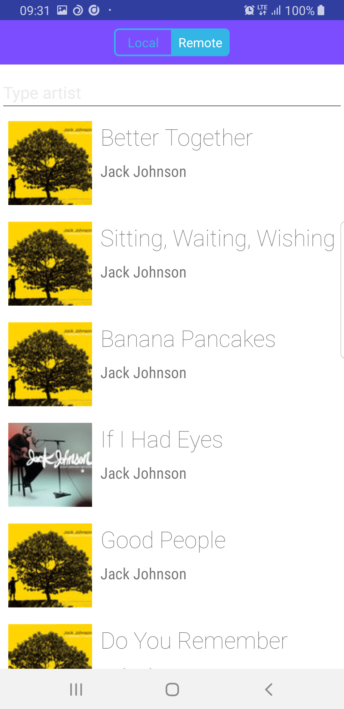
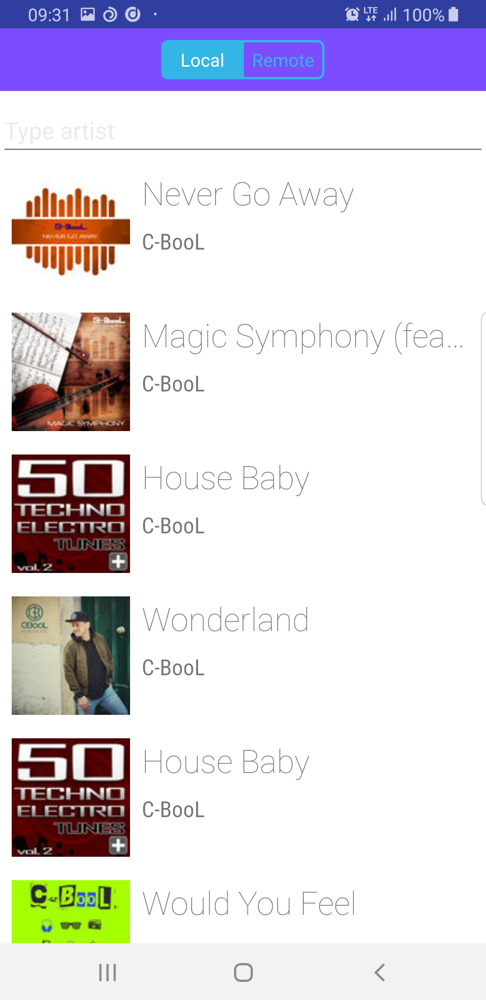

# Tooploox Song App - recruitment task

This app allows user to search and view music using two sources:
Remote API https://itunes.apple.com/search?term=jack+johnson&entity=song
Local storage JSON which is a result of search https://itunes.apple.com/search?term=cbool&entity=song

## Demo
# Remote default screen

By default are displayed results of search Jack Johnson

# Local default screen 
By default are displayed all results from local json file

## License

    Copyright 2019 Adrian Jeż

    Licensed under the Apache License, Version 2.0 (the "License");
    you may not use this file except in compliance with the License.
    You may obtain a copy of the License at

       http://www.apache.org/licenses/LICENSE-2.0

    Unless required by applicable law or agreed to in writing, software
    distributed under the License is distributed on an "AS IS" BASIS,
    WITHOUT WARRANTIES OR CONDITIONS OF ANY KIND, either express or implied.
    See the License for the specific language governing permissions and
    limitations under the License.
